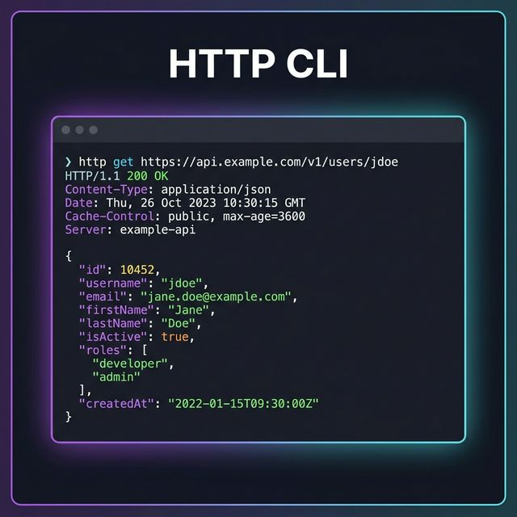

<div align="center">



# Httli

**A zero-dependency, colorful command-line HTTP client and developer workflow platform.**

[](LICENSE)
[](https://go.dev)
[](https://github.com/I-invincib1e/Httli/actions/workflows/go.yml)
[](CONTRIBUTING.md)

[Installation](#-installation) •
[Quick Start](#-quick-start) •
[All Flags](#-all-flags) •
[Collections](#-collections) •
[Environments](#-environments) •
[History](#-history) •
[Scripting & CI](#-scripting--ci) •
[How It Works](#-how-it-works)

</div>

---

## ⚡ What is Httli?

Httli is a fast, terminal-native HTTP client built in Go with **zero external runtime dependencies**. It goes beyond `curl` to give you a complete developer workflow — saved requests, environments, history, batch execution, and JSON extraction — all from your terminal.

```bash
# Fire a quick request
httli -u https://api.github.com/users/octocat

# POST with auth and body
httli -m POST -u https://api.example.com/login \
  -d '{"user":"admin","pass":"secret"}' \
  -b mytoken

# Save it, then run it in any environment
httli collection save auth/login -m POST -u {{BASE_URL}}/login -d '{"user":"admin"}'
httli collection run auth/login --env prod

# Run a whole test suite in CI
httli collection run-all auth/ --fail-fast --timeout 10s --format json
```

---

## 📦 Installation

### Build from source

```bash
git clone https://github.com/I-invincib1e/Httli.git
cd Httli
go build -o httli ./cmd/httli/main.go
```

**Build with version injection:**
```bash
go build -ldflags "-X github.com/I-invincib1e/httli/cmd.Version=1.1.0" -o httli ./cmd/httli/main.go
```

### Add to PATH

```bash
# Linux / macOS
sudo mv httli /usr/local/bin/

# Windows (Admin PowerShell)
Move-Item httli.exe C:\Windows\System32\
```

### Shell Autocomplete

```bash
source <(httli completion bash)        # Bash
source <(httli completion zsh)         # Zsh
httli completion powershell | Invoke-Expression  # PowerShell
```

---

## 🚀 Quick Start

### Send a request

```bash
# GET (default)
httli -u https://jsonplaceholder.typicode.com/posts/1

# POST with JSON body
httli -m POST -u https://api.example.com/users \
  -d '{"name":"Alice"}' \
  -H "Content-Type:application/json"

# With bearer token
httli -u https://api.example.com/me -b eyJhbGc...

# With basic auth
httli -u https://api.example.com/secure -a user:pass

# Read body from file
httli -m POST -u https://api.example.com/data -d @payload.json

# Read body from stdin
echo '{"key":"val"}' | httli -m POST -u https://api.example.com/data -d @-
```

### Command overview

| Command | Description |
|---------|-------------|
| `httli [flags]` | Quick mode — fires a request directly |
| `httli request send [flags]` | Explicit request with all options |
| `httli collection save <name> [flags]` | Save a request to your collection |
| `httli collection update <name> [flags]` | Update an existing saved request |
| `httli collection run <name> [flags]` | Run a saved request |
| `httli collection run-all [prefix] [flags]` | Run all saved requests (batch) |
| `httli collection list` | List all saved requests |
| `httli collection describe <name> <text>` | Annotate a saved request |
| `httli collection export <file>` | Export collections to JSON |
| `httli collection import <file>` | Import collections from JSON |
| `httli history` | View request history (last 50) |
| `httli history show <n>` | Inspect history entry details |
| `httli history clear` | Clear all history |
| `httli rerun <n> [flags]` | Re-execute a history entry |
| `httli env list` | Show loaded environment variables |
| `httli completion <shell>` | Generate shell autocomplete |
| `httli version` | Print version |

---

## 🔧 All Flags

### Request flags

| Short | Long | Default | Description |
|-------|------|---------|-------------|
| `-m` | `--method` | `GET` | HTTP method |
| `-u` | `--url` | — | URL to request *(required)* |
| `-d` | `--data` | — | Request body — JSON string, `@-` for stdin, `@file.json` for file |
| `-f` | `--file` | — | Read body from file (alternative to `@file`) |
| `-H` | `--header` | — | Headers as `Key:Value,Key2:Value2` |
| `-b` | `--bearer` | — | Bearer token (sets `Authorization: Bearer <token>`) |
| `-a` | `--auth` | — | Basic auth as `user:pass` (sets `Authorization: Basic ...`) |
| `-t` | `--timeout` | `30s` | Request timeout (Go duration: `5s`, `1m30s`) |
| `-L` | `--follow` | `false` | Follow HTTP redirects |
| `-e` | `--env` | — | Load `.env.<name>` in addition to `.env` and `.env.local` |

### Output flags

| Short | Long | Description |
|-------|------|-------------|
| `-o` | `--output` | Save response body to file *(always runs, even with `--raw`)* |
| `-x` | `--extract` | Extract a field from JSON response using dot notation (`.data.token`, `.items[0].id`) |
| | `--format json` | Output structured JSON (for piping to `jq`) |
| | `--raw` | Print raw body only — no colors, headers, or formatting |
| `-s` | `--status-only` | Print only the numeric status code |
| `-q` | `--quiet` | Print only the response body |
| `-S` | `--silent` | Suppress all output — exit code only |
| `-v` | `--verbose` | Show request/response headers |

### Control flags

| Short | Long | Description |
|-------|------|-------------|
| `-F` | `--fail` | Exit `22` on HTTP 4xx/5xx (curl convention) |
| | `--fail-fast` | Stop `run-all` batch on first error |
| `-r` | `--retry` | Number of retries on network error or 5xx |
| | `--retry-delay` | Seconds between retries (default: `2`) |
| | `--retry-backoff` | Opt-in exponential backoff — delay doubles each attempt, capped at 30s |
| | `--dry-run` | Print resolved request without making a network call |
| | `--ignore-missing-env` | Don't error on unresolved `{{VAR}}` placeholders |

---

## 📁 Collections

Collections let you save, name, and replay HTTP requests — with full fidelity, including auth, timeouts, and headers.

### Save and run

```bash
# Save a request (fails if name already exists)
httli collection save auth/login \
  -m POST \
  -u {{BASE_URL}}/auth/login \
  -d '{"user":"admin"}' \
  -b mytoken \
  --timeout 15s \
  --retry 2

# Add a description (shown in list)
httli collection describe auth/login "Authenticate and get session token"

# Update an existing request
httli collection update auth/login -b newtoken

# Run it
httli collection run auth/login --env prod

# Run with runtime overrides
httli collection run auth/login --timeout 5s --format json --verbose
```

### List and inspect

```bash
httli collection list
```

```
Saved Requests:

  Ungrouped/
    - ping [GET https://api.example.com/ping]

  auth/
    - login [POST https://{{BASE_URL}}/auth/login]  # Authenticate and get session token
    - refresh [POST https://{{BASE_URL}}/auth/refresh]
```

### What gets saved

Every field is persisted — nothing is silently dropped:

| Field | Saved? |
|-------|--------|
| Method, URL | ✅ |
| Headers | ✅ |
| Body | ✅ |
| Bearer token | ✅ |
| Basic auth | ✅ |
| Timeout | ✅ (stored as `"15s"`) |
| Follow redirects | ✅ |
| Retry count & delay | ✅ |
| Description | ✅ |
| Created / Updated timestamps | ✅ |

### Namespace grouping

Use `/` in the name to group requests:

```bash
httli collection save api/users/list   -m GET  -u {{BASE_URL}}/users
httli collection save api/users/create -m POST -u {{BASE_URL}}/users -d '{"name":"Bob"}'
httli collection save api/products     -m GET  -u {{BASE_URL}}/products
```

### Batch execution (run-all)

```bash
# Run everything
httli collection run-all

# Run only the auth/ group
httli collection run-all auth/

# Stop immediately on first failure
httli collection run-all --fail-fast

# Apply runtime overrides to all
httli collection run-all --timeout 10s --retry 1 --format json
```

**State chaining between requests** — `run-all` automatically sets env vars after each step:

| Variable | Value |
|----------|-------|
| `HTTLI_LAST_STATUS` | HTTP status code, e.g. `200` |
| `HTTLI_LAST_BODY_PATH` | Absolute path to temp file with raw body |
| `HTTLI_LAST_JSON` | Raw JSON body string (if ≤ 32KB, valid JSON) |

Use `{{HTTLI_LAST_JSON}}` in a subsequent request body to chain results:
```bash
httli collection save api/order -m POST -u {{BASE_URL}}/order \
  -d '{"token":"{{HTTLI_LAST_JSON}}"}'
```

### Export and Import

```bash
# Export all collections to file
httli collection export my-api.json

# Import (3 modes)
httli collection import my-api.json              # merge (default) — add new, skip conflicts
httli collection import my-api.json --overwrite  # replace all existing with imported
```

> **Tip:** Create a `.httli/` directory in your project root to scope collections to that project. Commit `.httli/` to share collections with your team alongside your code.

---

## 🌍 Environments

Use `{{VAR}}` placeholders anywhere — URLs, headers, body, auth — and substitute them with `.env` files.

### .env file format

```bash
BASE_URL=https://api.example.com
API_TOKEN=secret123
DB_USER=admin
```

### Loading order (highest priority last)

```
.env            → base defaults (committed, shared)
.env.local      → local overrides (git-ignored, personal)
.env.<name>     → activated via --env flag (e.g., .env.prod)
```

> **Safe for CI/CD:** Httli **never overwrites** an environment variable that already exists in the shell. Your CI platform's secrets always win.

### Usage

```bash
# Use base .env only
httli -u {{BASE_URL}}/users -b {{API_TOKEN}}

# Activate a specific environment
httli collection run auth/login --env prod   # loads .env + .env.local + .env.prod
httli collection run auth/login --env staging
```

### View loaded variables

```bash
httli env list
```

```
Active Environment: prod

Loaded files (in order):
  ✓ .env
  ✓ .env.local
  ✓ .env.prod
  ✗ (no other files)

Chaining Variables:
  HTTLI_LAST_STATUS = 200

All Environment Variables:
  API_TOKEN = secret123
  BASE_URL = https://api.example.com
```

### Missing variable behavior

```bash
# Strict mode (default) — errors on unresolved {{VAR}}
httli -u {{MISSING_VAR}}/api
# Error: environment variable 'MISSING_VAR' not found

# Permissive mode — leaves placeholder as-is
httli -u {{MISSING_VAR}}/api --ignore-missing-env
```

---

## 📊 History

Every executed request is automatically recorded. The last **50 entries** are kept.

```bash
# View history with status and duration
httli history
```

```
Request History:
  [1] ✓ GET https://api.example.com/users → 200 (124ms)  2026-04-01T01:00:00+05:30
  [2] ✗ POST https://api.example.com/login → 401 (89ms)  2026-04-01T01:01:00+05:30
  [3] ✓ GET https://jsonplaceholder.typicode.com/posts/1 → 200 (287ms)  2026-04-01T01:02:00+05:30
```

```bash
# Inspect a full entry (method, URL, headers, body, auth, duration)
httli history show 1

# Re-run entry #1 with overrides — full fidelity (headers, body, auth restored)
httli rerun 1
httli rerun 1 --timeout 5s --format json --verbose

# Clear all history
httli history clear
```

> **Full-fidelity rerun:** `rerun` restores the complete original request — method, URL, headers, body, bearer token, and basic auth — not just the URL.

---

## 🤖 Scripting & CI

Httli is designed for headless use in scripts and pipelines.

### Exit codes

| Code | Meaning |
|------|---------|
| `0` | Success |
| `1` | Usage error / network error |
| `22` | HTTP 4xx/5xx (when `--fail` is set) |

### JSON output pipeline

```bash
# Structured JSON output to pipe to jq
httli -u https://api.example.com/users --format json | jq '.body.users[0].name'

# Native extraction (no jq needed)
httli -u https://api.example.com/data --extract .items[0].id

# Dot-notation supports arrays
httli -u https://api.example.com/data --extract .data.users[0].email
```

### Stdin as request body

```bash
cat payload.json | httli -m POST -u https://api.example.com/ingest -d @-
```

### Silent mode for scripts

```bash
# Script only cares about exit code
httli -u https://api.example.com/health --fail --silent
if [ $? -eq 0 ]; then echo "API is up"; fi

# Just print status code
STATUS=$(httli -u https://api.example.com/health --status-only)
echo "Got: $STATUS"
```

### Dry run

```bash
# See the fully resolved request (env vars substituted) without firing it
httli -m POST -u {{BASE_URL}}/login -d '{"user":"admin"}' --env prod --dry-run
```

### Retry strategies

```bash
# Fixed delay retry (default)
httli -u https://api.example.com/data --retry 3 --retry-delay 5

# Exponential backoff (2s, 4s, 8s... capped at 30s)
httli -u https://api.example.com/data --retry 4 --retry-delay 2 --retry-backoff

# Verbose retry output to stderr (won't pollute stdout)
httli -u https://api.example.com/data --retry 2 --verbose
# → Retry 1/2 in 2s (HTTP 503)
# → Retry 2/2 in 2s (HTTP 503)
```

### CI/CD example

```bash
#!/bin/bash
# Run full API test suite, fail on first error, timeout per request, exit 22 on any 4xx/5xx
httli collection run-all smoke-tests/ \
  --env ci \
  --fail-fast \
  --fail \
  --timeout 10s \
  --retry 1 \
  --format json \
  --silent
```

### Save response to file

```bash
# --output works with ALL display modes (raw, silent, status-only)
httli -u https://api.example.com/report --output report.json --silent
httli -u https://api.example.com/report --output report.json --raw
```

---

## 🏗 How It Works

### Architecture

```
httli/
├── cmd/                        # Command layer (CLI entry points)
│   ├── httli/main.go           # Binary entry point
│   ├── root.go                 # Command dispatcher (recursive, N-depth)
│   ├── request.go              # httli [flags] / request send
│   ├── collection.go           # collection save/update/run/list/describe/export/import
│   ├── collection_runall.go    # collection run-all (batch execution)
│   ├── history.go              # history / rerun
│   ├── env.go                  # env list
│   ├── completion.go           # shell autocomplete
│   └── version.go              # version
├── internal/
│   ├── client/                 # HTTP execution engine
│   │   └── client.go           # ExecuteRequest, retry loop, backoff, auth
│   ├── config/                 # Flag parsing and env var system
│   │   ├── config.go           # Config struct, ParseFlags, ApplyOverrides
│   │   ├── env.go              # LoadEnv, Interpolate ({{VAR}} system)
│   │   └── global.go           # Global config (default env, project-local detection)
│   ├── collections/            # Collection storage (save/get/list/import/export)
│   │   └── collections.go
│   ├── history/                # Request history (record/load/list/show/clear)
│   │   └── history.go
│   ├── output/                 # Response rendering (pretty/raw/json/extract)
│   │   └── output.go
│   ├── storage/                # Path resolution (project-local vs global)
│   │   └── resolver.go
│   └── styles/                 # Terminal color styles (lipgloss)
│       └── styles.go
```

### Request lifecycle

```
httli -m POST -u {{BASE_URL}}/login -d '{"user":"admin"}' --env prod
         │
         ▼
1. ParseFlags()          — parse all CLI flags into Config struct
         │
         ▼
2. LoadEnv(prod)         — load .env, .env.local, .env.prod
         │                 (never overwrites existing shell vars)
         ▼
3. InterpolateAll()      — replace {{BASE_URL}} with env var value
         │                 (errors on missing vars unless --ignore-missing-env)
         ▼
4. Validate()            — ensure URL is present, format is valid
         │
         ▼
5. [dry-run check]       — if --dry-run, print request and exit
         │
         ▼
6. ExecuteRequest()      — make HTTP call
         │                 add Auth headers (bearer → Authorization: Bearer ...)
         │                 JSON body validation
         │                 retry loop (with optional exponential backoff)
         │                 5xx body always captured before retry
         │                 verbose retry logging to stderr
         ▼
7. history.Record()      — save full request + response metadata to history
         │
         ▼
8. DisplayResponse()     — render output:
                           --output saves file first (orthogonal to display mode)
                           then: extract → format json → raw → status-only → quiet → full pretty
```

### Storage locations

Httli uses **project-local storage** when a `.httli/` directory is detected in the current working directory. Otherwise it falls back to a **global directory**.

| Platform | Global path |
|----------|-------------|
| Windows | `%APPDATA%\httli\` |
| macOS | `~/Library/Application Support/httli/` |
| Linux | `~/.config/httli/` |

| File | Contents |
|------|----------|
| `collections.json` | All saved requests |
| `history.json` | Last 50 executed requests |

### Flag system internals

- `ParseFlags()` uses `flag.ContinueOnError` — unknown flags return errors instead of calling `os.Exit`
- All flags have both short (`-m`) and long (`--method`) forms registered in the same `FlagSet`
- `InterpolateAll()` is **not** called in `ParseFlags()` — callers invoke it explicitly, preventing double-substitution when `collection run` or `rerun` call it after loading the saved config
- `ApplyOverrides(runCfg)` merges runtime CLI flags onto a loaded collection config — timeout is only overridden if the user explicitly set a non-default value

### The `{{VAR}}` interpolation system

Placeholders are matched by the regex `\{\{\s*([A-Za-z0-9_]+)\s*\}\}` (compiled once at package level). The regex supports optional whitespace (`{{ VAR }}` or `{{VAR}}`). Interpolation runs across: URL, body, bearer token, basic auth, and all header values.

### Retry logic

```
attempt 1  → request → 5xx or network error → read body → save lastResp
attempt 2  → sleep(delay) → request → ...
attempt N  → sleep(delay) → request → 5xx → return lastResp (NOT an error)

# with --retry-backoff:
delay formula: baseDelay × 2^attempt, capped at 30s
attempt 1: 2s, attempt 2: 4s, attempt 3: 8s, attempt 4: 16s, attempt 5+: 30s
```

> On the final attempt, the 5xx `Response` is returned (not an error) so callers can inspect `resp.StatusCode` and `resp.Body` — enabling `--fail` exit code logic and run-all summary tables to work correctly with server error details.

---

## 🤝 Contributing

Contributions are welcome! See [CONTRIBUTING.md](CONTRIBUTING.md) for guidelines.

### Running tests

```bash
go test ./...
go vet ./...
```

### Project conventions

- All new features belong in `internal/` — keep `cmd/` as a thin dispatch layer
- `ParseFlags()` must not call `InterpolateAll()` — callers do this explicitly
- New config fields go in `Config` struct with both short+long flag registration
- Exported functions in `internal/` packages take `*config.Config`, not individual params

---

## 📄 License

MIT License — see [LICENSE](LICENSE) for details.
