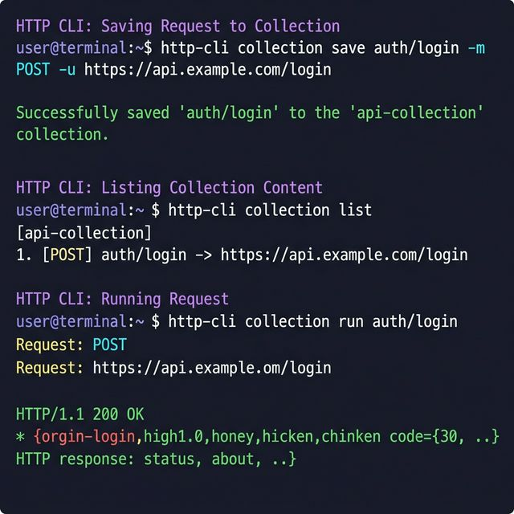
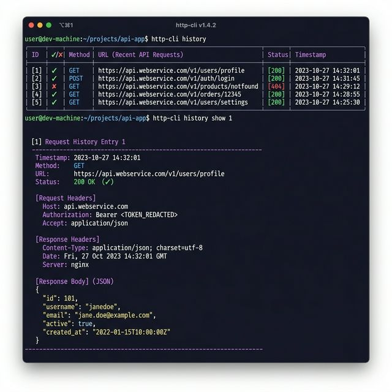

<div align="center">


# HTTP CLI

**A zero-dependency, colorful command-line HTTP client and API workflow platform.**

[](LICENSE)
[](https://go.dev)
[](CONTRIBUTING.md)

[Getting Started](#-getting-started) •
[Features](#-features) •
[Collections](#-collections) •
[Environments](#-environments) •
[History](#-history) •
[Contributing](#-contributing)

</div>

---

## ⚡ What is HTTP CLI?

HTTP CLI is a fast, beautiful, and **zero-dependency** command-line HTTP client built in Go. It goes beyond simple HTTP requests to provide a complete **developer workflow platform** — think Postman, but in your terminal.

```bash
# Simple request
http-cli -u https://api.github.com/users/octocat

# Save, reuse, and share API workflows
http-cli collection save auth/login -m POST -u {{BASE_URL}}/login -d '{"user":"admin"}'
http-cli collection run auth/login --env prod
```

---

## 📦 Installation

### Build from source

```bash
git clone https://github.com/I-invincib1e/Httli.git
cd Httli
go build -o http-cli ./cmd/http-cli/main.go
```

### Add to PATH (optional)

```bash
# Linux/macOS
sudo mv http-cli /usr/local/bin/

# Windows (PowerShell as Admin)
Move-Item http-cli.exe C:\Windows\System32\
```

### Enable Shell Autocomplete

```bash
# Bash
source <(http-cli completion bash)

# Zsh
source <(http-cli completion zsh)

# PowerShell
http-cli completion powershell | Out-String | Invoke-Expression
```

---

## 🚀 Getting Started

### Your first request

```bash
http-cli -u https://jsonplaceholder.typicode.com/posts/1
```

### Using subcommands

```bash
http-cli request send -m GET -u https://api.github.com/users/octocat
```

### Quick reference

| Command | Description |
|---------|-------------|
| `http-cli -u <url>` | Quick GET request |
| `http-cli request send [flags]` | Full request with all options |
| `http-cli collection [command]` | Manage saved requests |
| `http-cli history` | View request history |
| `http-cli rerun <n>` | Re-execute from history |
| `http-cli completion <shell>` | Generate autocomplete scripts |

---

## 🎨 Features

### Color-Coded Output
- 🟣 **Purple** — Section headers (`REQUEST`, `RESPONSE`)
- 🔵 **Cyan** — HTTP methods (`GET`, `POST`, `PUT`, `DELETE`, `PATCH`)
- 🟢 **Green** — Success status codes (2xx)
- 🟡 **Yellow** — Redirect status codes (3xx)
- 🔴 **Red** — Error status codes (4xx/5xx)

### All HTTP Methods
```bash
http-cli -m POST -u https://api.example.com/users -d '{"name":"John"}'
http-cli -m PUT -u https://api.example.com/users/1 -d '{"name":"Jane"}'
http-cli -m DELETE -u https://api.example.com/users/1
http-cli -m PATCH -u https://api.example.com/users/1 -d '{"role":"admin"}'
```

### Authentication
```bash
# Bearer token
http-cli -u https://api.example.com/data -b "your-token-here"

# Basic auth
http-cli -u https://api.example.com/data -a "username:password"
```

### Dry Run
Preview your fully interpolated request without hitting the network:
```bash
http-cli request send --dry-run -u {{BASE_URL}}/admin -b {{API_TOKEN}}
```

### Smart Retry
Automatically retry on network failures and 5xx server errors:
```bash
http-cli -u https://api.example.com/data --retry 3 --retry-delay 2
```

### JSON Validation
Catches invalid JSON bodies **before** making the network request:
```bash
http-cli -m POST -u https://api.example.com -d '{invalid'
# Error: invalid JSON body provided
```

---

## 📁 Collections



Save, organize, and replay your API requests like Postman — in the terminal.

### Save a request (fails if it already exists)
```bash
http-cli collection save auth/login \
  -m POST \
  -u {{BASE_URL}}/auth/login \
  -d '{"email":"admin@example.com","password":"secret"}'
```

### Update an existing request
```bash
http-cli collection update auth/login -d '{"email":"new@example.com","password":"new"}'
```

### Run a saved request
```bash
http-cli collection run auth/login --env prod
```

### List all saved requests
```bash
http-cli collection list
```

### Show request details (formatted)
```bash
http-cli collection show auth/login
```

### Delete a request
```bash
http-cli collection delete auth/login
```

### Export & Import (share with your team!)
```bash
# Export
http-cli collection export team-api.json

# Import with conflict handling
http-cli collection import team-api.json              # merge (default)
http-cli collection import team-api.json --overwrite   # replace conflicts
http-cli collection import team-api.json --skip        # skip conflicts
```

---

## 🌍 Environments

Use `.env` files with `{{variable}}` interpolation across URLs, headers, body, and auth.

### Create environment files
```bash
# .env (base defaults)
BASE_URL=https://dev.api.example.com
API_TOKEN=dev-token-123

# .env.local (local overrides)
API_TOKEN=my-personal-token

# .env.prod (production)
BASE_URL=https://api.example.com
API_TOKEN=prod-token-abc
```

### Loading order
```
.env          → base defaults
.env.local    → local overrides
.env.<name>   → environment-specific (via --env flag)
```

### Usage
```bash
# Uses .env + .env.local
http-cli -u {{BASE_URL}}/users -b {{API_TOKEN}}

# Uses .env + .env.local + .env.prod
http-cli collection run auth/login --env prod
```

### Global default environment
Create `~/.httli/config.json`:
```json
{
  "default_env": "dev"
}
```

### Strict variable checking
Missing variables fail fast by default:
```
Error: environment variable 'BASE_URL' not found
```
Bypass with `--ignore-missing-env` if needed.

---

## 📊 History



Every executed request is automatically saved with rich metadata.

```bash
# View history
http-cli history

# Inspect a specific entry
http-cli history show 1

# Re-execute a previous request
http-cli rerun 1

# Clear history
http-cli history clear
```

History entries include: timestamp, HTTP method, URL, and response status code. The last **50 requests** are retained automatically.

---

## 🔧 All Flags

| Flag | Long Form | Description |
|------|-----------|-------------|
| `-m` | `--method` | HTTP method (default: GET) |
| `-u` | `--url` | URL to request (required) |
| `-d` | `--data` | Request body (JSON string) |
| `-f` | `--file` | Read request body from file |
| `-H` | `--header` | Headers (`Key:Value,Key2:Value2`) |
| `-b` | `--bearer` | Bearer token |
| `-a` | `--auth` | Basic auth (`user:pass`) |
| `-o` | `--output` | Save response body to file |
| `-e` | `--env` | Environment name (loads `.env.<name>`) |
| `-t` | `--timeout` | Timeout in seconds (default: 30) |
| `-r` | `--retry` | Number of retries on failure |
| | `--retry-delay` | Delay between retries in seconds |
| | `--dry-run` | Print request without execution |
| | `--ignore-missing-env` | Don't fail on missing `{{VAR}}` |
| `-L` | `--follow` | Follow redirects |
| `-q` | `--quiet` | Only show response body |
| `-v` | `--verbose` | Show all details |
| `-s` | `--status-only` | Show only status code |

---

## 🏗️ Architecture

```
http-cli
├── cmd/
│   ├── http-cli/main.go   # Entrypoint
│   ├── root.go             # Command router + Levenshtein suggestions
│   ├── request.go          # request send
│   ├── collection.go       # collection save/run/list/show/update/delete/export/import
│   ├── history.go          # history list/show/clear + rerun
│   ├── completion.go       # Shell autocomplete generator
│   └── env.go              # env list
│
├── internal/
│   ├── client/client.go    # HTTP executor + retry logic
│   ├── config/
│   │   ├── config.go       # Flag parsing + interpolation
│   │   ├── env.go          # .env file loader
│   │   └── global.go       # Global config (~/.httli/config.json)
│   ├── collections/        # JSON collection storage
│   ├── history/            # Request history engine
│   ├── output/             # Colorful terminal renderer
│   └── styles/             # Lipgloss style definitions
│
├── docs/                   # How-to guides
└── assets/                 # Images for README
```

---

## 🤝 Contributing

We welcome contributions! Please see [CONTRIBUTING.md](CONTRIBUTING.md) for guidelines.

## 📄 License

This project is licensed under the MIT License — see the [LICENSE](LICENSE) file for details.

## 💬 Support

- Open an [Issue](https://github.com/I-invincib1e/Httli/issues)
- Discussions and feature requests are welcome

---

<div align="center">

**Built with ❤️ in Go — Zero Dependencies**

</div>
